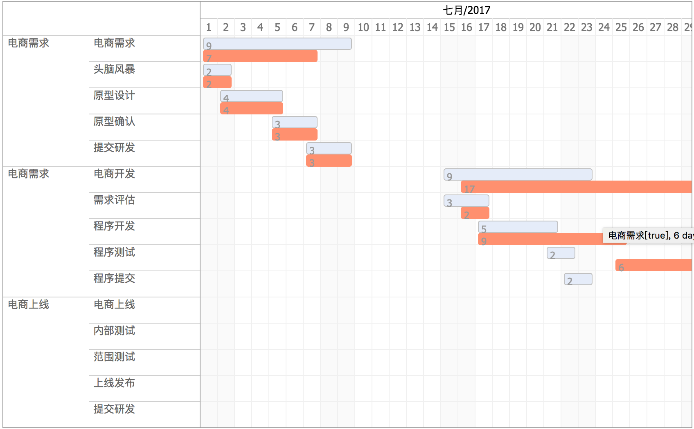

# gantt.js
甘特图 插件 依赖 jQuery.js date.js

- 两条线的甘特图[预期值]+[实际值] 插件
打破传统甘特图一条线的模式，采用`计划`和`实际`两条线，更加直观，并去掉一些拖动组件。

- Example


```
 
$("#ganttChart").ganttView({ 
  data: ganttData, //数据源
  slideWidth: 600, //定义大小，默认400
  behavior: {
    onClick: function (data) { //绑定点击事件
    console.log(data);
  }
});
			
			 
	 
```
 



